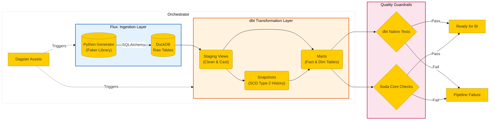
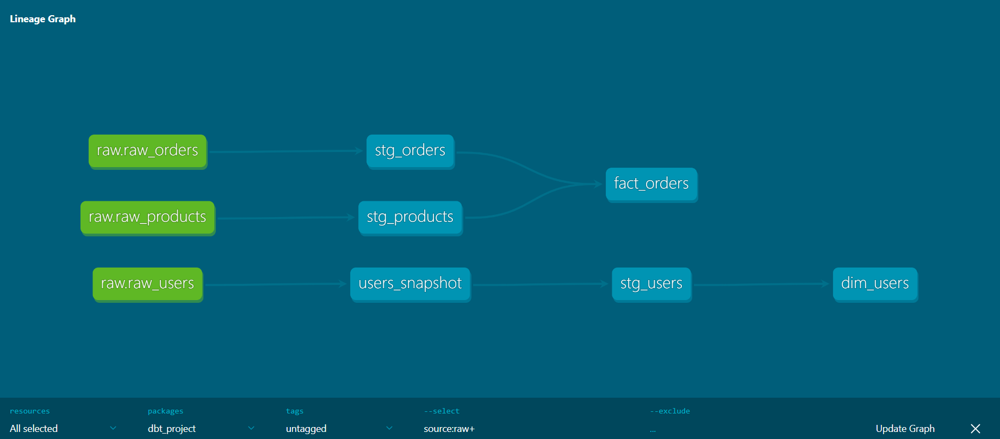

# 🛍️ Modern Data Platform: Automated ELT with Dagster, dbt, & DuckDB


A production-grade **Modern Data Stack (MDS)** implementation designed to ingest, transform, and validate analytical data with strict quality guardrails.

This project demonstrates a **Data Engineering Lifecycle** focusing on **SCD Type 2 (History Tracking)**, **Automated Quality Checks**, and **CI/CD Integration**, simulating a real-world environment for a financial or retail institution.

---

## 📊 Project Scope & Highlights

- **Goal:** Build a robust ELT pipeline that handles raw transactional data and transforms it into business-ready dimensional models.
- **Scale:** Optimized for high-performance local analytics using **DuckDB** (Columnar Storage), capable of processing millions of rows efficiently without heavy infrastructure overhead.
- **Engineering Standards:** Implements modular architecture, environment isolation (Docker/Virtualenv), and "Infrastructure as Code" principles.

---

## 🏗️ Architecture

The pipeline follows a declarative **Asset-Based Orchestration** pattern.



_(Figure 1: End-to-End Architecture rendered dynamically via Mermaid.js)_

### Data Flow Visualization

The following lineage graph illustrates the data transformation journey from raw source tables to final business marts, including the snapshot layer for history tracking.

<div align="center">
  
</div>

_(Figure 2: The dbt Lineage Graph generated from the project manifest)_

### Component Explanation:

1. **Ingestion:** Python scripts generate synthetic transactional data and load it into **DuckDB** using SQLAlchemy for stability in CI environments.
2. **Orchestration:** **Dagster** manages the dependency graph and materialization schedules.
3. **Transformation (dbt):**

- **Staging:** Renaming and type casting raw data.
- **Snapshots:** Handling **Slowly Changing Dimensions (SCD Type 2)** to track user address changes over time (`valid_from`, `valid_to`).
- **Marts:** Creating `fact_orders` and `dim_users` for downstream BI tools.

4. **Quality Assurance:**

- **dbt Tests:** Internal logic validation (e.g., ensuring order amounts are positive).
- **Soda Core:** External data contracts (e.g., schema validation, missing value checks).

---

## 📁 Repository Structure

```text
modern-data-platform-dagster/
├── .github/workflows/       # CI/CD Pipelines (Automated Testing)
│   └── ci_cd.yml
├── assets/                  # Project Documentation Images
│   └── dbt-lineage.png      # Lineage Graph Screenshot
├── dagster_project/         # Orchestration & Ingestion Logic
│   ├── __init__.py
│   └── fake_data_gen.py     # Data Generation Script
├── dbt_project/             # Transformation Layer
│   ├── analyses/            # (.gitkeep) Ad-hoc SQL queries
│   ├── macros/              # (.gitkeep) Reusable SQL functions
│   ├── models/              # Staging & Marts logic
│   │   ├── marts/
│   │   │   ├── dim_users.sql
│   │   │   └── fact_orders.sql
│   │   └── staging/
│   │   │   ├── stg_orders.sql
│   │   │   ├── stg_products.sql
│   │   │   ├── stg_users.sql
│   │   │   └── sources.yml
│   ├── seeds/
│   ├── snapshots/ # SCD Type 2 logic
│   │   └── users_snapshot.sql
│   ├── tests/ # Singular dbt tests (Custom SQL)
│   │   └── assert_total_amount_positive.sql
│   ├── .user.yml
│   ├── dbt_project.yml      # dbt Configuration
│   └── profiles.yml         # Connection profiles (Env var dynamic)
├── soda/                    # Data Quality Configuration
│   ├── checks.yml           # Data Contracts
│   └── configuration.yml    # Soda-DuckDB connection
├── .gitignore
├── dagster.yaml
├── docker-compose.yml
├── Dockerfile
├── Makefile
├── requirements.txt         # Python Dependencies
└── README.md                # Documentation

```

---

## 🛠️ Quick Start Guide

Follow these steps to deploy the data platform locally:

### 1. Clone the Repository

```bash
git clone [https://github.com/KMoex-HZ/modern-data-platform-dagster.git](https://github.com/KMoex-HZ/modern-data-platform-dagster.git)
cd modern-data-platform-dagster

```

### 2. Set Up Environment

```bash
python -m venv venv
source venv/bin/activate  # Windows: venv\Scripts\activate
pip install -r requirements.txt

```

### 3. Run the Pipeline

```bash
# 1. Ingest Data
python dagster_project/fake_data_gen.py

# 2. Transform Data & Track History
cd dbt_project
dbt deps
dbt snapshot
dbt run

# 3. Run Quality Checks
dbt test
cd ..
soda scan -d analytics -c soda/configuration.yml soda/checks.yml

```

---

## ⚠️ Production Considerations

This project is built with **Production-Grade** standards in mind:

1. **Ingestion Strategy:** Currently uses `SQLAlchemy` for CI/CD compatibility. For high-volume production datasets (>10GB), the pipeline is designed to switch to DuckDB's native `COPY` command or `read_parquet` for maximum I/O throughput.
2. **Environment Isolation:** The `profiles.yml` utilizes environment variables (`DUCKDB_PATH`), ensuring code portability between Local Development, Docker Containers, and GitHub Actions runners without code changes.
3. **Security:** No credentials are hardcoded. Database passwords and paths are managed via `.env` files and GitHub Secrets.

---

**Author:** Caelan Zhou

**Role:** Data Engineer / Data Science Student @ ITERA

**Location:** Bandar Lampung, Indonesia

**License:** MIT
